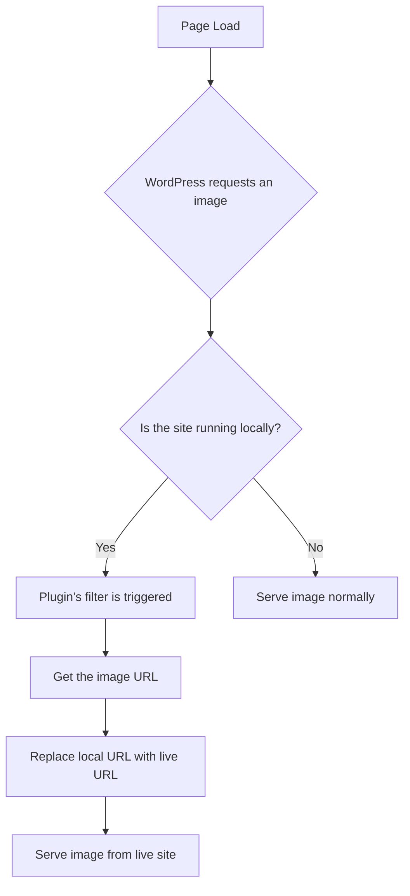

# Live Media Offloader Plugin

## 1. Plugin Details

*   **Plugin Name:** Live Media Offloader
*   **Plugin Slug:** `live-media-offloader`
*   **Description:** A simple plugin to reference the media library from the live environment, avoiding the need to store media files locally.
*   **Version:** 1.0.0
*   **Author:** Marc Maninang

## 2. Plugin Structure

The plugin is contained within the `live-media-offloader` directory inside of the `plugins` directory. It has the following structure:

```
plugins/
└── live-media-offloader/
    ├── live-media-offloader.php
    └── readme.txt
```

*   `live-media-offloader.php`: This is the main plugin file containing all the PHP logic.
*   `readme.txt`: A standard WordPress readme file with details about the plugin.

## 3. Core Logic and Implementation

The core of the plugin uses a WordPress filter to modify the URL of media assets. Here’s how it works:



The main logic in `live-media-offloader.php` is as follows:

1.  **Plugin Header:** A standard WordPress plugin header to ensure it's recognized by WordPress.
2.  **Configuration Constant:** We will define a PHP constant `LIVE_SITE_URL` in the `wp-config.php` file. This is a best practice for environment-specific configurations.
3.  **URL Rewriting Function:** A function that hooks into the `wp_get_attachment_url` filter. This function will check if the `LIVE_SITE_URL` constant is defined and, if so, replace the local URL with the live URL for all media attachments.

## 4. Configuration Step

To make this work, you will need to add the following line to your local `wp-config.php` file. This file is located in the root of your WordPress installation.

```php
define( 'LMO_LIVE_SITE_URL', 'https://www.yoursite.com' );
```

This approach keeps the live URL out of the plugin code, making the plugin reusable and the configuration clean.